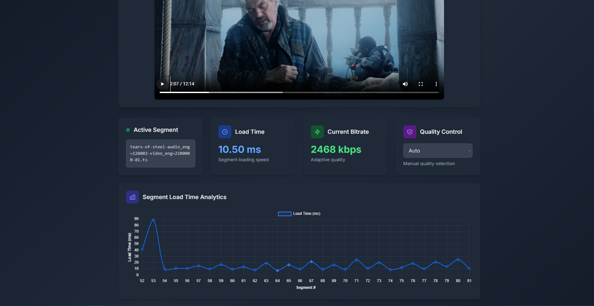
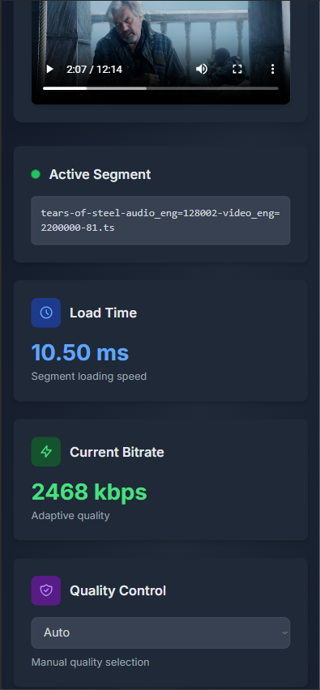
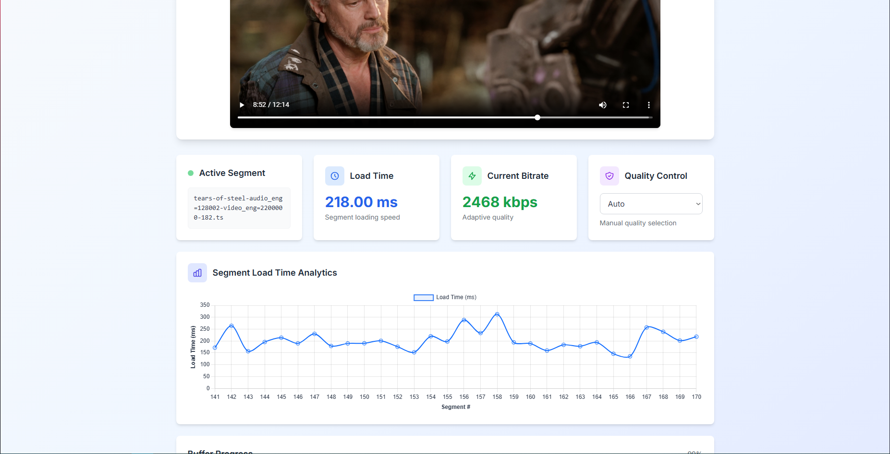

# 🎥 HLS.js Video Player with Real-Time Analytics

A custom-built, professional-grade video player powered by **HLS.js**, with live playback analytics and a polished Tailwind CSS UI. Built to showcase advanced front-end and streaming technology skills.

## 🚀 Features

- 📺 **Adaptive HLS streaming** with fallback support
- ⚙️ **Manual quality selection** (bitrate control)
- 📊 **Real-time analytics**:
  - Active video segment display
  - Segment load time (ms)
  - Current streaming bitrate
  - Buffer fill percentage with smooth UI
  - Live chart tracking segment download times (Chart.js)
- 🎨 Responsive, accessible UI styled with **Tailwind CSS**
- 🌙 Dark mode toggle
- 📱 Fully mobile responsive

## 🛠️ Technologies Used

- [HLS.js](https://github.com/video-dev/hls.js) — streaming core
- [Chart.js](https://www.chartjs.org/) — live data visualization
- [Tailwind CSS](https://tailwindcss.com/) — styling & responsive UI
- [Vite](https://vitejs.dev/) — fast development environment

## 📷 Screenshots






## 👤 AutPNG

Built with care and ambition by [**Etka Özer**](https://github.com/etkaozer).

## 📦 Setup

```bash
git clone https://github.com/etkaozer/hls-video-player.git
cd hls-video-player
npm install
npm run dev


